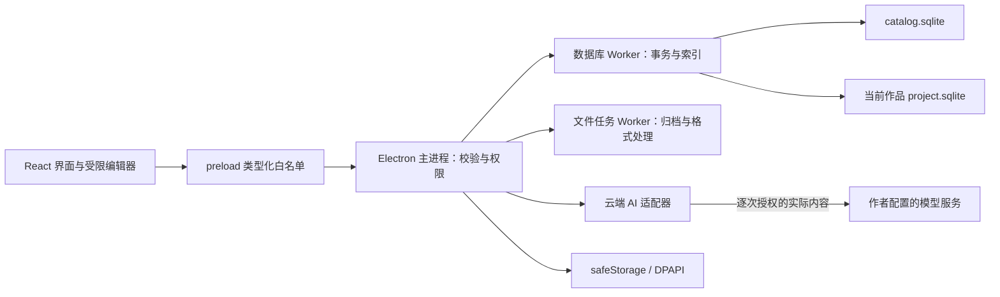

# Rain_Soul 技术方案

版本：T1.0　日期：2026-10-08　状态：基于已统一需求的实施建议，待技术验证与资源安排

需求来源：[立项 V2.0](Rain_Soul_项目立项方案_V2.0.md)；界面来源：[当前 Demo](demos/rainsoul-writing-style.html)；产品规格：[PRD](Rain_Soul_PRD.md)。

本文回答“如何实现”，不修改立项范围。`FR-01`～`FR-18` 与 PRD 对应。技术选型、目录、协议和阈值标为建议的内容，需要通过本文验证门槛后锁定；不代表已有代码或实测结论。

## 1 技术结论与实现边界

采用已确认的 Electron + React/TypeScript + SQLite。正式客户端从模块化工程实现，沿用 Demo 的页面、文案和交互；不把 Demo 的 DOM、标题键、内存 Map 或模拟保存直接包装成持久化产品。

P0 必须覆盖写作特点、大纲、知识/分类/引用、伏笔、基础 AI、剧情感受、一致性检查、正文回写、版本/备份和 DOCX/TXT。以下批次是 P0 内部实施顺序，不能把 AI 移出首版。需求会话、拆书、URL、XMind、向量和本地模型仍后置，入口显示统一提示。

| 决策 | 推荐实现 | 选择理由与代价 |
| --- | --- | --- |
| 客户端进程 | 主进程协调权限；渲染进程只管交互；数据库 Worker 单写者 | 隔离阻塞与权限；需维护 IPC 和进程恢复协议 |
| 编辑器 | Tiptap/ProseMirror，受限结构化文档 | 支持中文输入、事务和原子书签；自定义节点与 ID 插件需验证 |
| 数据持久化 | `better-sqlite3` 放入 Worker，参数化 SQL 与版本化迁移 | 事务直接、离线简单；原生模块必须匹配 Electron ABI |
| 作品隔离 | 全局目录库 + 每作品独立 SQLite | 快照/导入/删除互不污染；全局汇总需合并只读结果 |
| 搜索 | FTS5 trigram + 单字/双字子串兜底 | 支持中文短词；兜底扫描必须实测，不假定达标 |
| 文件格式 | `.rainsoul` ZIP 归档；受限 OOXML 导入；`docx` 库导出 | 可检查、可往返；解析限制、字体映射和格式样例需覆盖 |
| AI 接入 | 主进程中的可替换云端协议适配器 | 客户端不依赖 Python 服务；不同服务协议需兼容矩阵 |
| 密钥 | Electron `safeStorage`，Windows 使用 DPAPI | 无额外服务；不防同一 Windows 用户下的恶意进程 |

Python/FastAPI 单独作为 AI 学习和验证实验，不进入客户端启动链，不作为 SQLite 写入或正式模型请求的必需代理。

## 2 进程、模块与目录



主进程负责单实例锁、窗口、文件对话框、活动作品会话、命令校验、密钥和网络请求。数据库 Worker 持有写连接并串行执行命令；渲染进程和文件任务不能直接打开可写数据库。文件 Worker 处理压缩、解析、导出，避免冻结窗口；数据库 Worker 失联后进入失败保护，禁止静默重启并重放写命令。

建议使用 Vite 的 React/TypeScript 构建链与 `electron-builder` Windows NSIS 打包，工程目录如下；这是目标结构，当前仓库仅有 Demo 和测试，创建后才能使用相应命令。

```text
src/main/               窗口、IPC、权限、密钥、AI、任务编排
src/preload/            按功能暴露的窄接口
src/shared/contracts/   DTO、Zod schema、错误码、文档 schema
src/renderer/           白色/天蓝色设计变量、路由与通用组件
src/renderer/features/  shelf、writing、plot、foreshadow、knowledge、settings、ai
src/workers/database/   SQL 仓储、串行队列、迁移、快照、FTS
src/workers/files/      归档、TXT、OOXML、DOCX 输出
tests/unit/             领域规则、编辑器插件与协议校验
tests/integration/      SQLite、IPC、文件和模型模拟服务
tests/e2e/              Electron 主流程与 Windows 打包验收
tests/fixtures/         固定搜索样本、归档和手稿格式样例
experiments/ai-python/  独立学习实验，不随客户端强制运行
```

本机目录建议：`%LOCALAPPDATA%\RainSoul\catalog.sqlite` 保存唯一作品集、作者档案、偏好和作品目录；`Projects/<workId>/project.sqlite` 保存作品；`Profile/` 保存本地头像；`Secrets/` 只保存 DPAPI 密文；`Logs/` 保存脱敏诊断。备份导出到作者选择的位置，临时任务使用应用内专用目录。

目录库中的作品字数/更新时间是可重建缓存。作品数据库提交成功后，目录更新失败不能回滚已保存正文；记录待刷新状态并在启动时校准。新建作品先初始化临时目录，再原子发布目录并登记目录库；启动扫描修复“目录已发布但目录库尚未登记”的中断状态。

## 3 数据模型与约束

ID 采用 UUID，名称只供展示。外部定位使用 `{workId, entityId}`；同名作品、章节和知识不共用实体。时间存 UTC，界面本地化；排序使用显式整数并在同级排序事务中重排。作品中的软删除记录、旧来源和不可变快照不被索引重建清除。

| 数据组 | 核心表与字段 | 约束 |
| --- | --- | --- |
| 全局档案 | `author_profile(pen_name, avatar_path)`、`preferences` | 头像/笔名不属于作品快照；侧栏只显示名称 |
| 唯一作品集 | `collection`、`work_catalog(work_id, title, deleted_at, cached_revision)` | 固定一个作品集；删除作品后目录记录和数据仍可恢复 |
| 作品版本 | `work_meta(id, schema_version, revision)`、`revision_log(id, reason, operation_id)` | 每次成功领域提交递增 revision；操作 ID 唯一 |
| 卷章正文 | `volume`、`chapter(volume_id?, title)`、`paragraph(chapter_id, inline_json, sort_order, deleted_at)` | 标题独立于正文；章可不属卷；段落稳定 ID |
| 写作特点 | `style_profile(id, version, payload)`、作品/章的版本指针 | 旧版本不可改；章节覆盖指向明确版本 |
| 剧情树 | `outline_node(type, parent_id?, chapter_id?, summary)` | 卷→章→详细节点；无卷可直接建章；禁止环 |
| 剧情知识 | `outline_knowledge(node_id, knowledge_id)` | 同作品、多对多、组合唯一 |
| 知识条目 | `knowledge_entry(body, category_id, source, origin_work_id?, origin_entry_id?, deleted_at)` | 无必填独立标题；每条一个主分类 |
| 已审核知识事实 | `knowledge_fact(entry_id, kind, subject_ref?, attribute, value_json, source_revision, reviewed_at)` | 类型化扩展，未经逐条审核不作规则事实；不按同名自动合并 |
| 分类/标签 | `category(parent_id?, name)`、`tag(name)`、`knowledge_tag(entry_id, tag_id)` | 分类无环；标签名内空格保留；关联唯一 |
| 伏笔 | `foreshadow(name, status, outline_node_id?)` | 五状态枚举；一条至多归属一个剧情节点 |
| 正文书签 | `bookmark(id, paragraph_id, kind, target_id, deleted_at)` | 行内节点使用 bookmark ID；目标为同作品知识或伏笔 |
| 伏笔证据 | `evidence(id, foreshadow_id, kind, chapter_id?, paragraph_id?, excerpt, source_revision, original_source, supersedes_id?)` | 主键与伏笔外键；可仅指章节；原始出处不可被重新关联冒充 |
| 快照 | `snapshot(id, source_revision, reason, schema_version, payload_hash, compressed_payload)` | 整作品资产；不可变；不递归包含旧快照 |
| AI 候选 | `ai_candidate(operation, base_revision, dependency_hashes, status, base_payload, result)` | 候选状态与正式资产分离；未确认不改正文/知识 |
| 派生搜索 | `search_document` + FTS 表 | 包含来源 ID、规范化文本；可从正式数据重建 |

作品库启用外键、WAL、`synchronous=FULL` 和有上限的 busy timeout，所有写入参数化。每作品单独数据库确定实体作用域，内部关联只存 entity ID，跨作品来源另存 origin work ID；不在每个 snapshot JSON 重复可变当前 workId。正式持久关联不使用 Demo 的章节标题键；复杂外键、`kind` 目标校验、树父级类型和分类环检查同时由领域服务执行，不能只靠界面禁用。

分类/标签按作品拥有。设置维护当前作品字典；新作品可从固定默认模板初始化人物描写、景物描写、内心描写、经典引用等。“未分类”是系统保留项不可删除；删除父分类前先移动子分类，再事务迁移其条目并删除，禁止未经确认级联删除。全局汇总展示各作品所属分类和标签，不把同名标签变成实时共享对象。

跨作品复制先预览选当前主分类，标签按当前字典匹配；缺失标签由作者在设置维护后选择，不能暗中创建。新条目创建新 ID，并保留原作品/条目 ID、出处和复制时版本；复制主体在当前作品事务中完成，不写来源库。

删除剧情节点：一个事务软删除选中子树、解除知识关联、清空有关伏笔的节点归属；知识、伏笔和正文证据保留。删除卷/章：先保护版本，再软删除正文实体，解除活跃剧情章节关联并保留历史来源，证据转为失效；查询失效来源时不以同名实体替代。

伏笔删除事务先保存保护版本，再软删除目标、解除现行节点归属和正文书签；历史快照/原证据保留。书签清理后的正文、字数和索引一起更新，不清理正文文本或其他伏笔。作品删除推荐采用目录库 tombstone，保留作品目录；恢复入口放设置的本机数据管理，不自动清理或追加 P0 永久删除功能。

## 4 编辑器、书签与界面迁移

正文 schema 仅允许 `doc → paragraph(id) → text / hardBreak / bookmark(id)`，首版不开放任意 HTML、Markdown、图片、表格或自由字体标记。Tiptap 输出 JSON 经 Zod/ProseMirror schema 校验，数据库按段落保存 inline JSON；加载章节时组装文档。粘贴先归一为允许的文本/段落，外部 HTML 不挂入 DOM。

建议的 ID 插件规则：拆段时左段保留原 ID、右段新建；并段时左段保留 ID、右段 tombstone；整段移动保留 ID，复制生成新段落和新书签 ID。书签随编辑事务移动，保存时正文节点与 bookmark 索引在同一数据库事务对账；被并掉段落的历史证据明确失效，作者可重新关联，不能按偏移猜测。

书签是 `inline + atom` 原子节点，视觉为可点击标记，内部目标 ID 不依赖其名称。从工具栏/段落菜单插入时使用光标段落，多段选区取首段；点击定位详情，删除标记只移除当前 bookmark，不删除目标。知识软删除后显示已删除占位和历史摘要；伏笔删除后的正文占位策略见第 15 节。

字数从结构文档的 text 节点计算，排除 bookmark；按 Unicode 字符迭代，汉字与 ASCII `A-Z/a-z/0-9` 计一，标点/空白/换行不计。通过编辑事务增量更新当前章，落盘时重新校验该章字数并更新作品/卷汇总；避免每次输入扫描整部作品。中文 IME 组合期间不重建编辑器，验证长时间组合与保存时序。

固定样式常量同时驱动编辑器和 DOCX：正文微软雅黑 12 pt（CSS 16 px）、1.5 倍、`#242424`；章节标题微软雅黑 16 pt（CSS 21.333 px）、加粗、`#1C1C1C`。同源常量防止数值漂移；屏幕换行与纸张分页不同，不承诺逐行相同。TXT 不携带样式。

React 组件保留 Demo 的“正文/剧情架构/伏笔架构”标签、折叠侧栏、作品书架、无标题两行知识卡原位展开、设置纵向分组。写作特点、全文搜索、版本/快照、导入导出建议放作品菜单，不新增第四主标签。自动保存、单实例锁、费用提示和逐次授权是强制规则，正式设置显示只读说明，不沿用 Demo 的可关闭开关。

多选关联以受控 ID 集合展示，右侧复选框、提示不作选项、勾选立即出现在下方；伏笔归属转移先显示原节点说明，随后单命令事务更新。保存失败时阻止离开正文，焦点不出现蓝色编辑框；按钮和弹窗仍有键盘焦点、焦点返回与屏幕阅读名称。

## 5 命令协议与权限

preload 不暴露通用 `invoke(channel, args)`、SQL、文件路径访问或 Node 对象。按功能暴露 `works.open`、`chapters.save`、`plot.setKnowledgeLinks`、`foreshadows.assignNode`、`search.query`、`snapshots.restore`、`archive.import`、`ai.prepare/authorize/apply` 等白名单方法，所有调用返回结构化结果。

建议 DTO：请求含 `requestId`、`operationId`、`workId`、`sessionToken`、`expectedRevision` 和领域 payload；返回 `ok + data + committedRevision` 或 `ok=false + code + retryable + message`。request ID 用于诊断，operation ID 用于本地写操作去重，不能用于自动重发云端 AI。

主进程依次校验 IPC sender/frame、Zod 输入、当前活动作品会话、目标实体归属、revision 和操作权限；只允许当前作品写入。全局/他作知识查询用只读命令，跨作复制只写当前作品。读写切换作品时注销旧 session token，迟到回复不能污染新作品界面。

| 错误码 | 界面行为 |
| --- | --- |
| `SAVE_FAILED` / `DB_BUSY` / `DISK_FULL` | 保留草稿，进入失败保护，手动重试 |
| `REVISION_CONFLICT` / `STALE_CANDIDATE` | 显示变化，重新读取/对比，不强制覆盖 |
| `SOURCE_MISSING` / `WORK_READ_ONLY` | 不跳转到同名对象，不修改他作 |
| `INVALID_FILE` / `UNSUPPORTED_SCHEMA` | 导入停止，保留现有作品与可读诊断 |
| `AI_TIMEOUT` / `AI_QUOTA` / `AI_NETWORK` / `AI_CANCELLED` | 保留原文和候选状态，人工重试 |
| `KEY_UNAVAILABLE` / `MIGRATION_FAILED` | 停止相应服务或写入启动，不用明文/旧库兜底 |

生产窗口启用 `contextIsolation=true`、`nodeIntegration=false`、`sandbox=true`、`webSecurity=true`，使用本地应用协议和限制 CSP；渲染进程不直接 fetch 模型，不加载远程脚本。图标、字体和界面依赖本地打包，不能沿用 Demo 的 CDN 图标脚本作为离线产品依赖。

## 6 自动保存、失败与崩溃恢复

保存状态：`clean → dirty → saving → clean`；失败进入 `failed`，重试成功后若其间又有输入仍回到 `dirty`，禁止旧回复把新草稿标成已保存。章标题、正文、大纲、知识等修改统一经过领域提交；整个作品只有一个数据库写队列。

1. 首次未保存修改记录 dirty 时间；输入停顿 500ms 提交。连续输入的硬期限从首次 dirty 计算，最长 5 秒完成落盘，不随下一次输入重置；预留写入预算提前提交，期限和失败路径必须在基线设备实测。
2. 队列合并尚未提交的同对象最新编辑，正在提交的批次不可被改写；每批校验 expected revision，并原子更新实体、字数、索引和 revision。
3. 只有 Worker 返回持久提交的 ACK 才标已保存。ACK 丢失时按 operation ID 查询已提交结果，避免重复写入；未确认状态继续保护草稿。
4. `flush(workId)` 捕获当前草稿并等待全部队列 ACK。切换章/作品/页签、快照、备份、导出、删除和关闭都需通过此门禁。
5. 磁盘满、权限、锁和 Worker 中断保留界面草稿与错误状态；保存成功前阻止上述动作，提供重试，不自动丢弃草稿。
6. Electron 关闭事件先拦截，flush 成功才退出。操作系统强杀、断电无法被应用阻止；启动用 WAL 恢复最后成功提交，未提交输入不能伪称已经保存。

SQLite 事务是持久事实，界面内存只是草稿。可增加独立的安全恢复草稿文件作为工程保护：只存本机、带 revision/hash、原子替换，不能把其写入成功等同正式保存；该策略需在磁盘故障与隐私检查后确定，正式 P0 不依赖它才可保存。

## 7 快照、恢复与归档

快照 payload 保存整作品资产：作品结构/正文、写作特点版本和覆盖、大纲、知识/审核事实/分类/标签/软删除、引用、伏笔和证据。使用版本化 JSON + gzip + SHA-256；不嵌套旧 snapshot，不含全局作者档案/密钥/日志。自动保存 revision 是顺序记录，不承诺把每次按键都变成可浏览整作品快照；提取来源同时保留当时文本/hash和revision，不能只用revision指向已被覆盖的当前段落。

`SnapshotCodec` 按 payload 的 schema_version 解码并在内存转换到当前领域模型，原快照字节/hash保持不变；SQLite 前向迁移不会自动升级历史 JSON。恢复和历史导出共用该解码器，不支持版本明确拒绝，不进行部分恢复。升级测试保留旧快照 fixture 验证恢复与历史导出。

恢复流程：`flush → 验证目标快照 → BEGIN → 保存当前完整状态为 before-restore 快照 → 复制目标资产为当前 → 重建索引/校验引用 → 生成新 revision 和 restored 快照 → COMMIT`。新 revision 从恢复前当前 revision 单调递增，不复制旧快照的计数器；revision_log/snapshot 历史表不被 payload 覆盖。旧快照不改，当前恢复前状态可访问；任一步失败整体回滚。恢复使旧 AI 候选/分析过期，只作历史保存，不能因恰好正文相同便直接应用。

`.rainsoul` 推荐内容：`manifest.json`、一致的作品 SQLite 镜像和作品附件。manifest 包含格式版本、数据库 schema 版本、来源作品 UUID、应用版本、文件列表/长度/SHA-256。镜像包含快照历史和作品内候选状态，排除目录库、密钥与日志；归档包含正文，应明确作为本地私有数据由作者保存。

导出使用 SQLite Online Backup API 获取一致镜像，禁止在 WAL 活跃时只复制 `project.sqlite`。建议 flush 后在独立导出 Worker 的只读源连接手动 `BEGIN`，随后 `SELECT revision` 建立读快照，固定为 revisionCut，再 `await reader.backup(tmp)`；数据库写连接继续串行保存，不能冻结写队列直至压缩完成而突破 5 秒。不能将异步备份包进 `db.transaction(async ...)`，该事务包装器不跨 await 保持事务；用 finally 结束手动读事务并关闭连接。

该组合的源连接机制有官方文档与源码依据，仍必须在 SP-05 验证所选版本、固定 revisionCut 和持续保存时序。备份完成立即释放读视图；WAL 下读快照允许写入，但会阻止旧页检查点回收，须监测空间增长和任务时限。取消/超限时停止备份、丢弃临时镜像并关闭源连接；不能把未完成镜像当成功结果。

格式压缩在文件 Worker 执行。临时输出写在目标目录，同卷原子重命名后才报告成功；已有同名文件须确认替换，失败不损坏原文件。若所选驱动不能可靠维持备份读视图，改用验证过的 SQLite 备份封装，不以长时间锁住保存作为交付方案。

导入顺序：限制压缩/展开大小及条目数 → 校验 ZIP 路径/条目 → 临时目录解包 → manifest/hash/格式检查 → 不可信 SQLite 只读读取 → schema/数据/关联校验 → 复制合法数据到新建规范库 → 规范数据版本转换与校验 → 预览/作者确认 → 分配新 work UUID → 发布新目录 → 登记作品集。作者取消或失败不改原作品，不修改原输入包。

输入库禁用扩展加载、`trusted_schema`，先核对版本对应表/字段和允许的类型，再只用固定 SQL 读取真实表；不执行输入库 trigger/view，不对输入库直接前向迁移，不把它重命名成正式库。Hash/integrity/foreign key 只检完整性，不能证明 schema 可信。版本、snapshot JSON、文档节点和所有关系均按相应版本 schema 及限额校验；合法旧数据由应用转换为当前规范 DTO，再写新库的固定 schema、重建索引。未来不支持的版本明确拒绝。

ZIP 推荐 yauzl 逐项流读取；拒绝路径穿越、绝对路径、Windows 设备名/ADS冒号、链接、重复规范化路径。声明大小校验不能代替累计实际展开限额；不允许包内执行脚本、额外数据库或任意附件路径。

作品内实体 UUID 在不同 workId 命名空间内可保留，因此正文、证据、关联和历史 snapshot 仍互相匹配；新 work_meta/目录记录使用新 UUID，快照内部关系以导入作品作用域解释，不改历史来源。`origin_work_id/origin_entry_id` 与历史出处保留真实原值，不重写成新来源。若支持的旧格式包含当前归属 workId，导入转换须统一去除/更新归属并重新计算新快照校验，同时保留旧 payload hash 作来源记录；不能把内部归属与外部来源一起盲改。历史 PreparedRequest/payload/hash 作为当时记录原样冻结，不变成新项目可重发授权；导入后所有候选过期，重新发起需按新作品生成请求并授权。

ZIP/解析限制建议首轮设 128 MiB 压缩、512 MiB 展开、10,000 项，含超限预检与明确错误；这些只是防异常输入的工程候选值，不是作品长度上限。发布前用真实大作品验证并调整，不能静默截断内容。

## 8 本地搜索与知识汇总

`search_document` 保存 paragraph/knowledge 来源、规范化 body、知识出处/标签和可定位 ID；正式数据和索引在同一事务更新，软删除不进正常检索。原文不改写，索引副本按 NFC 与大小写规则规范化。排序固定且分页，不以卡片摘要代替全文检索。

查询至少三个 Unicode 字符时使用 FTS5 trigram 子串索引候选；一/二字用限定作品/分类范围的参数化 `instr(normalized_text, query)` 兜底。参数化并限制 FTS 查询语法；含 `%`、`_`、引号等按文字搜索，不让用户关键词变 SQL/FTS 语法。标签 AND 用关系表交集，空标签不筛选。

知识页查询内容、出处、标签；正式全文搜索限当前作品，同时返回正文和知识，带来源、片段和目标 ID，不因知识范围下拉新增跨作品正文搜索。标签 AND 只作用知识结果，不把无标签关系的正文隐藏或当作标签命中。知识的全局汇总只读分批查询各作品库并合并，标注 workId；限制并发、取消过时请求、排除删除作品，不能用某一作品的标签 ID 套到他作。其具体同名分类/标签筛选规则在第 15 节锁定。

基线严格沿用立项：100 章、100 万统计字、1000 条知识；四核/8 GB/SSD 的 Windows 10/11 64 位；20 条固定查询各 10 次，覆盖单字、双字、长词、无结果、标签组合。预热一次不计，200 个 UI 延迟样本合并排序，P95 为第 190 个值且 ≤ 1 秒。

夹具建议 `tests/fixtures/search-baseline-v1.json`，生成器种子/版本、查询文本、设备、应用与 SQLite 版本记录在报告中。时间从 UI 发起到结果显示，含 IPC/检索/渲染，不用纯 SQL 时间冒充。未达标先评估短词索引/分页/Worker 调度；只有关键词真实不足后再考虑向量，不能据性能问题扩产品范围。

## 9 TXT/DOCX 手稿与导出

手稿导入流程：文件对话框 → 只读解析临时草稿 → 章节标题规则与预览修改 → 作者确认 → 新作品事务 → 发布到作品集。TXT 建议默认 UTF-8/BOM，遇解码问题提示选择 GB18030；不确定编码不静默替换。规则覆盖中文常见“第…卷/章”、阿拉伯编号和可识别 DOCX 标题，无法识别则一章；具体规则版号与样例验收，不能擅自把所有短行都当标题。

DOCX 推荐受限 OOXML：安全解包并解析 `word/document.xml`、`styles.xml`，只读顶层正文段落，图片/表格/文本框不导入并计数提示；保留 `w:t`，将 `w:tab`/`w:br`/`w:cr` 转为空格/换行。标题级别合并段落 `outlineLvl`、`pStyle` 对应样式和 `basedOn` 继承；缺失/继承环时降级段落进入预览。

XML 禁止 DTD/外部实体，限制节点数、深度和总大小。备选使用 Mammoth 的语义 HTML 转换后在 Worker 不可执行解析；`extractRawText` 不能单独用于保留标题。依赖在解析验证任务中定案，导入器输出同一 `ManuscriptDraft`，不把 HTML 当正文存储。

导出先 flush 并读取固定 revision 的一致资产视图，在 Worker 顺序遍历卷→章→段落；后续输入不混入本次输出。历史快照导出冻结当时知识内容，不能替换成当前条目。`docx` 库映射字体、字号半磅、颜色和行距；无卷直接输出章。TXT 建议 UTF-8、CRLF；编码和卷标题样式是工程默认，见第 15 节。

知识引用使用同一 `{workId, knowledgeId}` 首次出现分配编号，重复复用；文末只列一次内容/来源，删除目标输出明确占位。伏笔正文输出 `[伏笔：名称]`，文末输出五状态与多阶段章节/段落证据，失效来源保留说明。导出标记不反向污染正文和字数，归档另走完整数据流程。

## 10 AI 请求、授权与候选事务

首个适配建议 OpenAI-compatible HTTP 协议，具体服务由作者配置，不能宣称所有云端厂商都兼容。定义 `ProviderAdapter.prepare/estimate/stream/cancel`；请求、流、错误统一成内部 DTO。不同协议增加适配器，保持业务层不依赖某厂商 SDK；P0 不开启 Ollama。

AI 请求状态：`prepared → awaiting_authorization → sending → streaming → candidate_ready`；异常进入 `failed/cancelled`。修改候选另有 `stale → recompare → awaiting_apply → accepted/rejected`。断网不发起、不排队，联网后人工重试；服务 SDK 的网络/429 自动重试必须禁用。

1. flush 当前正文，按当前章、前章衔接、全卷或自定义 ID 范围读取一致视图；前章按正文顺序，首章提示无前章，无卷禁用全卷并说明，自定义只选本作品章节。检索当前作品知识参考，作者查看/选用内容和出处。
2. 形成不可变 `PreparedRequest`，含目标正文、上下文、大纲、StyleProfile、参考知识、依赖版本/hash、服务 endpoint/model、token 估计与计费提示。界面展示实际发送内容和范围，不能只提示“当前章”却偷偷携带全卷。
3. 授权绑定 PreparedRequest hash 与一次性 token；发送前再次校验。内容、服务、范围或分块计划变化必须重新确认，不能用历史全局授权替代。
4. token 上限按适配服务能力读取/配置，保留输出预算；超长让作者缩小范围或确认完整分块计划。已授权的固定分块属于一次操作，不允许失败自动重发；增加未列出的块需再次授权。
5. 流式内容只进入候选，限制响应字节/持续时间并可取消；取消将操作标为终态并 Abort，所有迟到 chunk/完成回调按 operation token 丢弃，不能生成可应用新结果。错误保留原文、已接收候选和状态，不写正文。费用未知时显示“按服务计费，无法估算”，不能编造金额；估算与实际账单区别呈现。
6. 作者对比后确认；校验目标与实际发送依赖未改变，变化则 stale 并重新生成或重新对比。单句保存 `paragraphId + baseRevision + 本次选区from/to + 基准文本/hash`，用编辑事务映射验证，重复句不能只凭文本匹配；映射冲突拒绝自动定位。这是本次选择定位，不用偏移作为长期书签。
7. apply 先 flush 最新草稿，再核对候选基准、依赖版本及 `draftGeneration`。从最终确认到数据库事务 ACK/界面应用期间短暂锁定目标编辑事务；出现新输入则中止应用并重新对比，不能只用数据库 revision 判断未落盘草稿。随后在单个 SQLite 事务 CAS expectedRevision，自动保存完整 before-AI 快照，写正文/索引/新 revision 并标候选 accepted。
8. 修改知识/伏笔原子标记必须在候选差异中列明并获作者确认，不能静默删除；快照失败、冲突或写入失败全部回滚，释放目标编辑锁但保留草稿。ACK 丢失先按 operation ID 查询结果，不能重复应用或以旧候选覆盖新的编辑器状态。

建议每作品同时只允许一个执行中的云端 AI 操作，作者仍可写作；所有候选以 source revision 与依赖 hash 检查陈旧。候选采用结构化受限输出，模型返回 HTML/脚本按纯文本处理；不提供工具执行、文件访问或模型直接操作数据库。

密钥读取和解密只在主进程，渲染进程只见“已配置”。`safeStorage.isEncryptionAvailable()` 失败时拒绝持久保存，提示重新配置；不能回退明文。归档、日志、错误上报和复制内容排除密钥；DPAPI 只提供 Windows 用户层保护，迁移到别的机器/用户后重新输入密钥。

云端 endpoint 工程建议仅 HTTPS，禁止 URL 内凭据，验证解析地址并拒绝私网/环回/链路本地；不跟随重定向转发 Authorization。规则需覆盖 DNS 解析变化；本地模型作为后置专用适配，不通过放宽云端权限实现。调试模拟服务只在开发/测试构建开放。

## 11 知识参考、回写与分析

知识参考走关键词检索和作者选用，不做首版向量数据库。参考内容以明确的数据边界和来源包进 prompt，不能将知识/手稿中的“忽略规则”等文本视为系统指令。生成润色候选应解释参考写法与修改理由，最终入稿仍由作者判断。

正文回写输出 `ExtractionCandidate[]`，每项含类型、内容、来源章/段落/正文版本、分类/已有标签建议和证据。候选在独立表保存；逐条接受才创建正式知识，摘要/角色/事件/伏笔都是知识类型，不能自动新建正式伏笔、改状态或剧情树。接受时确认来源仍匹配，过时则重新审核；接受多项在事务中记录各项状态和版本，禁止候选重复入库。

新建知识保留原出处、来源 revision、当时文本和 hash；来源正文后来变化不改写历史事实，UI 标记“来源已变化”。AI 推荐未知标签/分类不隐式创建，作者在设置维护或选择未分类，符合知识字典边界。更新已有条目须作者显式选择稳定目标 ID，不能按同名覆盖；接受事务必须先保存 before-update 整作品快照，再更新知识/审核事实/索引与 revision，保护版本失败则全部不更新。新建条目不额外强制整作品快照。

角色/事件等用知识条目附带 `knowledge_fact` 表示。`kind` 为 summary/character/event/foreshadow/passage；`attribute` 和 `value_json` 用类型化 schema 表示人名/别名、事件时间文本、地点、描述等，source revision 与段落证据保留。只有 reviewed_at 非空的事实可供规则；subject_ref 只由作者关联到已有知识，不按人名猜测实体合并，未知/冲突事实不成为确定结论。

一致性六维度全部覆盖，但不承诺对文学判断零误报。规则检查显式矛盾：失效引用/证据、非法状态、已回收但无证据、禁用项命中等；角色、时间、地点和情节合理性主要由 AI 分析自由正文/素材提供建议，不额外要求作者先建未确认的复杂角色/时间线系统。

分析结果 DTO 包含 `dimension`、`message`、`evidenceIds`、`uncertainty`、`sourceRevision`、`kind=rule|ai`。服务返回的章/段落 ID 必须在已发送范围验证；无法核对的证据标记未验证，禁止编造链接。剧情感受结合大纲/上下文输出衔接、合理性和偏离建议；规则有可定位证据，AI 明示建议和不确定性，不自动改稿。

## 12 模块实现与测试映射

| PRD ID | 实现模块/关键责任 | 必需验证 |
| --- | --- | --- |
| FR-01 | shelf、profile、catalog；唯一作品集和稳定作品 ID | 同名隔离、头像/名称、删除取消/恢复 |
| FR-02 | writing、editor schema、wordCount | 中文 IME、粘贴、无卷、字数、固定样式 |
| FR-03 | plot、tree service、association picker | 三层树、同级排序、多选同步、伏笔转移 |
| FR-04 | foreshadow、bookmark、evidence | 五状态、段落移动、失效/重关联、双向定位 |
| FR-05 | styleProfile repository 与生效解析器 | 版本不可变、章覆盖、快照与 AI 内容 |
| FR-06 | knowledge、taxonomy、copy service | 分类环、迁移事务、AND、只读与来源复制 |
| FR-07 | searchDocument、FTS、query worker | 单/双字、特殊符号、UI P95 和定位 |
| FR-08 | saveCoordinator、write queue、flush | 500ms/5s、迟到 ACK、磁盘满、关闭阻断 |
| FR-09 | snapshots、restore service | before/after 均可访问、失败全回滚 |
| FR-10 | archive worker、manifest validator | WAL 一致镜像、攻击归档、新作品往返 |
| FR-11 | manuscript draft、TXT/OOXML parser | 编码、标题继承、复杂内容警告、新作品 |
| FR-12 | provider adapters、authorization、keyStore | 每次授权、payload 一致、密钥无泄露 |
| FR-13 | candidate/diff/apply transaction | 原文变化、取消/超时、自动快照、CAS |
| FR-14 | reference retrieval、extraction review | 当前作品范围、逐条接受/拒绝、来源变化 |
| FR-15 | rule engine、analysis DTO、AI suggestions | 六维覆盖、有效证据、建议标签、不改稿 |
| FR-16 | export worker、shared style constants | DOCX/TXT、顺序、重复编号、伏笔清单 |
| FR-17 | settings、installer、migration、offline gate | 无网络/CDN、普通用户、单实例、失败恢复 |
| FR-18 | deferred route 与 Demo 参考保留 | 统一提示、返回、无错误交付标识 |

单元测试覆盖领域逻辑与边界，集成测试真实临时 SQLite 和文件，E2E 走 Electron 白名单与界面。AI 使用可控模拟服务测试授权、慢流、429、超时、格式错误和取消；真实服务只做作者授权的适配验证，不能把随机模型回复做严格快照断言。

每次核心开发遵循失败测试→最小实现→重构→相关验证→中文原子提交；核心逻辑覆盖目标 80%+，修复点必须有回归。交付运行完整套件、Lint/类型、Windows 构建、审查和必要人工检查。Demo 的现有 Playwright 测试可迁移为 UI 参考，不替代 SQLite/AI/文件门禁。

## 13 Windows 交付、升级与可观测性

Electron、Node、SQLite 原生模块、Tiptap、构建链与文件库固定验证版本，提交 lockfile；不在方案中指定未经验证的“最新”版本。构建以 Windows x64 为目标，原生依赖按 Electron ABI 重建，并在干净机器安装后的程序里执行 SQLite/FTS 自检；开发机 Node 加载成功不代表安装包成功。

NSIS 使用普通用户安装，默认保留 `%LOCALAPPDATA%\RainSoul`；删除数据只允许作者明确选择。安装/原位升级/卸载在 Windows 10 与 11 x64 记录具体系统构建、路径含中文/空格、权限、第二次启动聚焦及杀毒提示。发布签名证书、分发渠道和具体最低系统构建由资源决策确定，不擅自加入自动在线升级。

启动顺序：单实例锁→目录/凭据状态检查→备份待迁移数据库→前向迁移→integrity/foreign key 检查→加载界面。仅对发生 schema 变化的数据库迁移；未打开作品也需在目录库登记待迁移状态，打开前完成。迁移备份用一致镜像，失败关闭连接后恢复备份并禁止写入启动，不自动降级。

日志建议 JSON Lines：时间、级别、operation/request ID、脱敏 work ID、阶段、错误码、耗时、结果；不记录正文、完整 prompt、知识内容、密钥、候选或敏感文件路径。保留窗口与自动清理额度需明确，诊断导出经预览选择，不做未授权遥测。

监测保存耗时/失败率/队列深度、搜索 UI 延迟、归档阶段、AI 延迟/失败/取消，指标留本机并无正文。依赖锁定时核对许可证和传递依赖；优先使用可离线打包的开源核心，Tiptap 付费扩展/云协作不进入本方案；生成第三方许可清单并检查已知高风险漏洞。

## 14 技术验证与 P0 内部批次

下表为开工前/首批的短实验，有退出条件；实验完成前不能把选型建议写成实现已完成。

| 验证 | 实验与退出门槛 | 不通过时的处理 |
| --- | --- | --- |
| SP-01 编辑器 | 中文 IME、千段落、split/merge/move、书签/撤销恢复，ID 无重复且引用不误跳 | 调整 schema/插件；必要时比较直接 ProseMirror |
| SP-02 SQLite/ABI | 打包 Windows x64 后建库、事务、WAL、FTS trigram 和备份恢复均通过 | 选兼容驱动/构建版本；保持 Worker 单写者 |
| SP-03 保存 | 连续输入最长 5 秒提交、迟到 ACK 不清草稿；磁盘/锁/强杀后无已提交丢失 | 优化队列/提交预算；未达标不能放行 |
| SP-04 中文搜索 | 固定夹具 200 个 UI 样本 P95≤1秒，单/双字正确 | 添加短词索引或调整执行；不跳过短词 |
| SP-05 文件往返 | reader固定r后writer提交r+1/r+2，备份全部表仍为r且writer各次保存≤5秒；多选/失效来源导入新UUID一致，旧snapshot升级后可恢复/历史导出；输入trigger/view不执行，损坏/超限/路径攻击全拒绝 | 修正备份封装、SnapshotCodec/schema安全转换、命名空间或限制 |
| SP-06 DOCX/TXT | 中文标题/样式继承、图片表格警告、无标题单章；DOCX 固定样式与编号检查 | 更换 OOXML/成熟库实现，保留统一草稿接口 |
| SP-07 AI | 模拟服务证明未授权零请求、精确 payload、禁止重试、取消后迟到回调丢弃；确认前500ms新草稿不被CAS覆盖、重复句定位准确、snapshot/apply原子 | 修正适配/授权/draftGeneration/事务，禁止直接写入兜底 |

| 批次 | 前置依赖 | 完成条件 |
| --- | --- | --- |
| B0 基础与实验 | 资源安排、SP-01/02 | 工程启动、IPC/schema、安全边界、可打包安装 |
| B1 写作与保存 | B0、SP-03 | FR-01/02/08/17，重启恢复/断网写作可验收 |
| B2 作品资产 | B1、SP-04 | FR-03/04/05/06/07，稳定关联和中文搜索 |
| B3 数据保护/格式 | B2、SP-05/06 | FR-09/10/11/16，版本/归档/手稿/导出往返 |
| B4 云端修改 | B2/B3、SP-07 | FR-12/13，全范围授权、候选和版本保护 |
| B5 完整 AI 主流程 | B4 | FR-14/15，知识参考、审核回写、六维分析 |
| B6 首版验收 | B1～B5 | 全部 P0、FR-18 提示、完整质量门禁与安装包测试 |

书架/资料 UI 可在数据库契约锁定后并行；知识与剧情/伏笔在稳定 ID 和保存契约确定后并行；AI 适配实验可早做，正式 apply 依赖快照/CAS。负责人、人力、预算和工期未定，不能据上述批次承诺日期。每批交付记录验收证据，学习卡随任务维护，完成作品集后整理为普通“学习路径”作品。

## 15 实施前需要锁定的小范围规则

以下是基线尚未给出全部细节的工程/交互问题，推荐值供实施评审，不重开已经确认的产品主线；影响用户语义的项目应先写回 PRD/立项，不能由代码暗中决定。

| 问题 | 推荐方案 | 最晚锁定点 |
| --- | --- | --- |
| 作品删除如何恢复、多久保留 | 本机数据管理提供恢复；默认保留至作者明确清理，不自动永久删除 | FR-01 删除持久化前 |
| 分类含子分类的删除 | 先移动子分类再迁移条目，禁止未经确认级联；未分类保留不可删 | FR-06 分类维护前 |
| 全局汇总同名分类/标签 | 按显示名称组合各作品只读匹配，保留原作用域与名称映射；不实时共享 | FR-06/07 全局查询前 |
| 段落拆并/复制后的证据 | 第 4 节 ID 策略，原证据保留并标失效，重新关联留原记录 | FR-02/04 插件前 |
| 伏笔软删除后行内显示 | 清理现行书签和归属，保留历史与可恢复状态，不删其他正文 | FR-04 删除前 |
| 写作特点覆盖方式 | 章明确选择作品默认或一个不可变配置版本，避免隐式合并不清楚 | FR-05 表单前 |
| 字母/数字字数扩展口径 | 沿用 Demo ASCII；其他字母、全角数字单独确认，不擅自加权 | FR-02 字数函数前 |
| 云端协议、分块授权/费用 | 第一种兼容协议先验收；固定批次完整授权、费用未知明示 | FR-12 适配前 |
| 手稿编码/章标题规则 | UTF-8/BOM 优先、GB18030 显式选择；版本化标题样例集 | FR-11 解析前 |
| 导出卷标题、TXT编码/换行 | 卷标题复用标题样式，TXT UTF-8/CRLF；保留原章名不自动重编号 | FR-16 格式验收前 |
| 文件大小与解析资源限制 | 第 7 节候选限制先实验，超限明确拒绝，不限制作品编辑字数 | FR-10/11 发布前 |
| 发布与可信安装 | 明确系统构建矩阵、签名和渠道；当前不追加在线升级功能 | FR-17 安装交付前 |

主要风险：单人资源可能无法同时完成完整 P0；长篇结构化编辑/短词搜索/快照增长需实测；云端分析质量和费用由服务能力影响；只做团队测试留下真实作者使用体验验证不足。对应处理为资源排期、上述实验、测试夹具与候选可撤销规则，不能降低既定数据保护门槛。

## 16 技术依据与更新规则

以下官方资料在 2026-10-08 阅读核对，支持机制选择，不代表项目已验证版本兼容或性能：

- [Electron 安全清单](https://www.electronjs.org/docs/latest/tutorial/security)：隔离、沙盒、CSP 和 IPC sender 校验。
- [Electron safeStorage](https://www.electronjs.org/docs/latest/api/safe-storage)：Windows DPAPI 与加密可用性/保护边界。
- [SQLite FTS5](https://www.sqlite.org/fts5.html)：trigram 的三字符分词与短于三字符 MATCH 限制。
- [SQLite Online Backup API](https://www.sqlite.org/backup.html)：运行中数据库的一致备份机制。
- [Tiptap 文档输出](https://tiptap.dev/docs/guides/output-json-html)：JSON 文档持久化与 schema 思路。
- [Electron 原生模块](https://www.electronjs.org/docs/latest/tutorial/using-native-node-modules)与 [better-sqlite3 Worker](https://github.com/WiseLibs/better-sqlite3/blob/master/docs/threads.md)：ABI 重建与连接隔离。
- [better-sqlite3 backup](https://github.com/WiseLibs/better-sqlite3/blob/master/docs/api.md#backupdestination-options---promise)、[源连接实现](https://github.com/WiseLibs/better-sqlite3/blob/master/src/objects/backup.cpp)、[异步事务限制](https://github.com/WiseLibs/better-sqlite3/blob/master/docs/api.md#caveats)：源连接与手动读事务的组合须按锁定版本验证。
- [SQLite 隔离](https://www.sqlite.org/isolation.html)与 [WAL](https://www.sqlite.org/wal.html)：读事务快照、并行写入及长读导致的检查点限制；未实测前不承诺备份下保存时延。
- [OOXML 段落样式](https://learn.microsoft.com/en-us/dotnet/api/documentformat.openxml.wordprocessing.paragraphstyleid)、[样式继承](https://learn.microsoft.com/en-us/dotnet/api/documentformat.openxml.wordprocessing.basedon)、[大纲级别](https://learn.microsoft.com/en-us/dotnet/api/documentformat.openxml.wordprocessing.outlinelevel)：标题识别的依据。
- [Mammoth 安全说明](https://github.com/mwilliamson/mammoth.js#security)、[yauzl](https://github.com/thejoshwolfe/yauzl#openpath-options-callback)：HTML 不可信与 ZIP 读取限制。

后续调整必须同时记录 FR 影响、数据迁移、失败恢复和验收证据；本文更新实现路径，产品范围仍以立项与同步修订的 PRD 为准，页面以 Demo 为准。不能再建立相互矛盾的第二份立项或把实验结论混进已确认需求。
